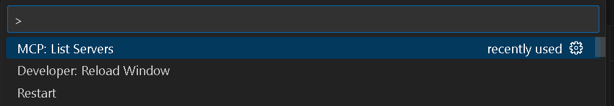

# SQL MCP - SQL Server for Model Context Protocol

A Model Context Protocol (MCP) server implementation for SQL Server queries that enables natural language interaction with your database through GitHub Copilot.


## Overview

SQL MCP allows you to query SQL Server databases using natural language through GitHub Copilot. This integration makes database interaction more accessible without requiring extensive SQL knowledge.

Key features:
- Natural language queries to SQL Server databases
- Integration with GitHub Copilot
- JSON-formatted responses
- Works with Azure SQL Database

## Prerequisites

- .NET 9.0 SDK or later
- Visual Studio 2022 or Visual Studio Code
- GitHub Copilot with Agent Mode
- SQL Server or Azure SQL Database access

## Setup Instructions

1. **Clone the repository**
   ```bash
   git clone https://github.com/ustabar/sql-mcp.git
   cd sql-mcp
   ```

2. **Configure the database connection**

   Edit the `appsettings.json` file to update your database connection string:
   ```json
   {
     "ConnectionStrings": {
       "AzureSqlConnection": "Server=yourserver.database.windows.net,1433;Database=yourdatabase;User Id=yourusername;Password=yourpassword;TrustServerCertificate=True;"
     }
   }
   ```

3. **Build and run the application**
   ```bash
   dotnet build
   dotnet run
   ```

4. **Configure VS Code for MCP**

   Add the MCP server to your VS Code settings:
   
   

   Example settings entry:
   ```json
   "github.copilot.advanced": {
     "mcp": {
       "enabled": true,
       "mcp_server_command": "dotnet run --project C:\\path\\to\\sql-mcp"
     }
   }
   ```

5. **Verify the MCP server is running**

   You can check available MCP servers in VS Code:
   
   

## Usage

Once set up, you can query your database in natural language through GitHub Copilot Agent Mode:


The MCP server processes your natural language query, converts it to SQL, and returns the results in a structured format.

Example interaction:


## Structure

- **Program.cs**: Application entry point and MCP server configuration
- **Services/SqlConnectionService.cs**: Manages database connections
- **Tools/SqlServerTools.cs**: Implements the MCP tools for SQL interaction
- **Data/prompt-tr.txt**: Contains prompt templates for Turkish language support

## Contributing

Contributions are welcome! Please feel free to submit a Pull Request.

## License

This project is licensed under the MIT License - see the LICENSE file for details.